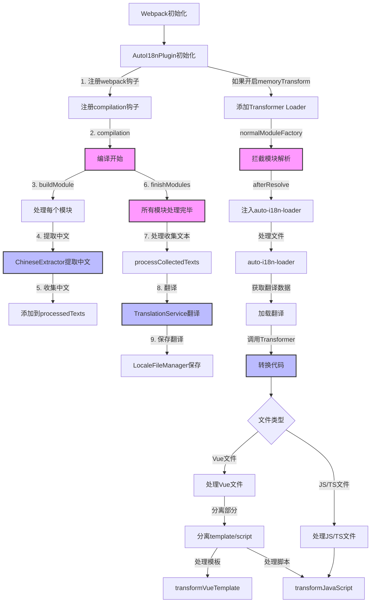

```mermaid
flowchart TD
    %% 主要流程概述
    webpack[Webpack初始化] --> plugin[AutoI18nPlugin初始化]
    plugin --> |1. 注册webpack钩子| hooks[注册compilation钩子]
    
    hooks --> |2. compilation| compilation[编译开始]
    compilation --> |3. buildModule| perModule[处理每个模块]
    perModule --> |4. 提取中文| extract[ChineseExtractor提取中文]
    extract --> |5. 收集中文| collect[添加到processedTexts]
    
    compilation --> |6. finishModules| finishMod[所有模块处理完毕]
    finishMod --> |7. 处理收集文本| processTxt[processCollectedTexts]
    processTxt --> |8. 翻译| translate[TranslationService翻译]
    translate --> |9. 保存翻译| save[LocaleFileManager保存]
    
    %% 内存转换流程
    plugin --> |如果开启memoryTransform| addLoader[添加Transformer Loader]
    addLoader --> |normalModuleFactory| factory[拦截模块解析]
    factory --> |afterResolve| inject[注入auto-i18n-loader]
    
    %% Loader处理流程
    inject --> |处理文件| loader[auto-i18n-loader]
    loader --> |获取翻译数据| getTrans[加载翻译]
    getTrans --> |调用Transformer| transform[转换代码]
    
    %% 转换细节
    transform --> check{文件类型}
    check -->|Vue文件| vue[处理Vue文件]
    check -->|JS/TS文件| js[处理JS/TS文件]
    
    vue --> |分离部分| split[分离template/script]
    split --> |处理模板| template[transformVueTemplate]
    split --> |处理脚本| script[transformJavaScript]
    
    js --> script
    
    %% Webpack钩子标注
    classDef hook fill:#f9f,stroke:#333,stroke-width:2px;
    class compilation,buildModule,finishMod,factory hook;
    
    %% 核心处理类标注
    classDef core fill:#bbf,stroke:#333,stroke-width:2px;
    class extract,translate,transform core;
```